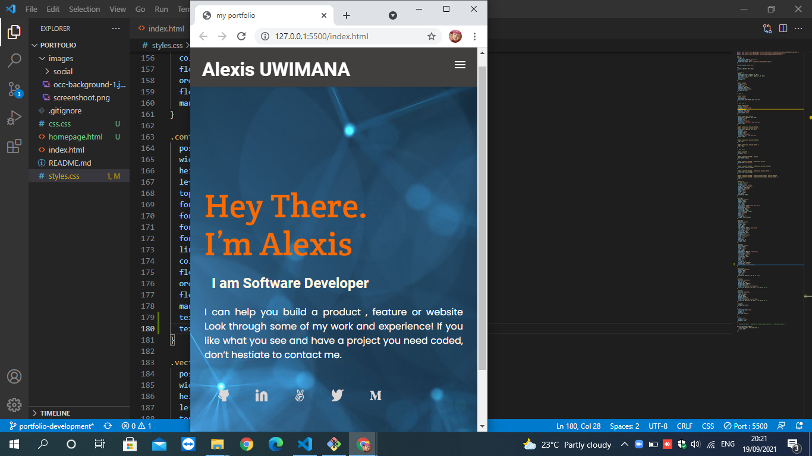

# portfolio project

> this is my first portifolio.

home page for mobile skeleton

## Built With

- HTML 
- CSS
- No framwork used in this project

## Live Demo

[Live Demo Link](https://livedemo.com)

## Getting Started

**to start you need t create a repository and clone it to your local computer**

## Author

👤 **Alexis UWIMANA**

- GitHub: [@githubhandle](https://github.com/alexisuwimana)
- Twitter: [@twitterhandle](https://twitter.com/alexisuwimana)
- LinkedIn: [LinkedIn](https://www.linkedin.com/in/alexis-uwimana-38381148/)

## 🤝 Contributing

any contribution to imporove is welcome

## Show your support

Give a ⭐️ if you like this project!

## Acknowledgments

- microverse
- Hat tip to anyone whose code was used
- Inspiration
- etc

## 📝 License

This project is [MIT](./MIT.md) licensed.
